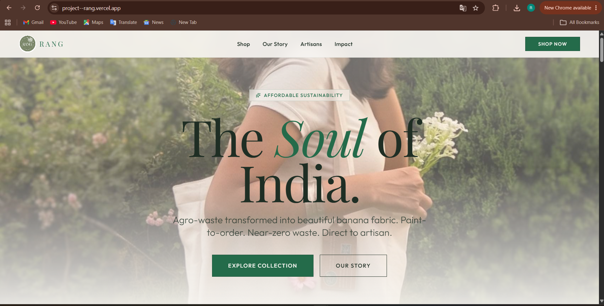
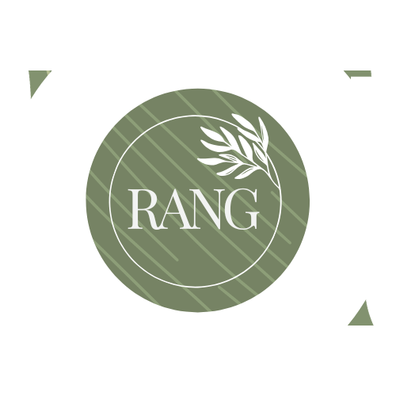
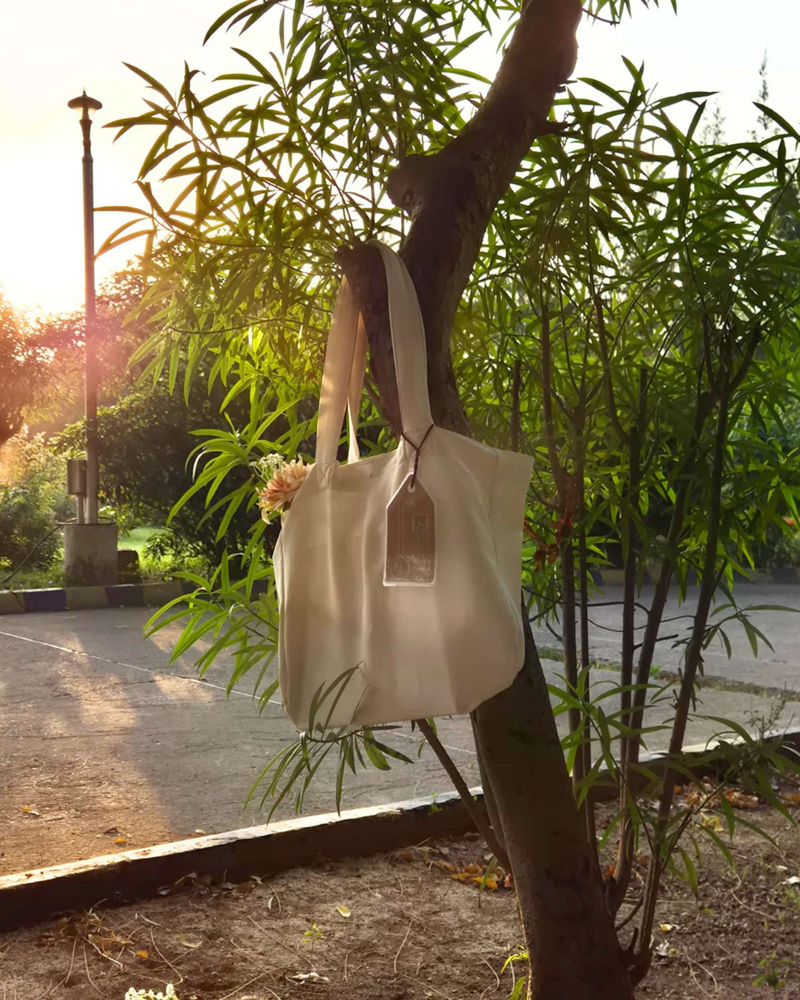
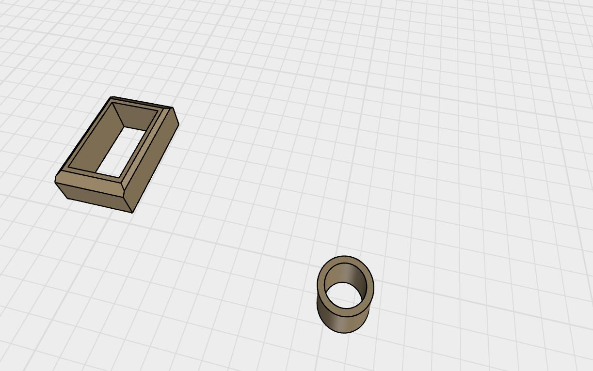
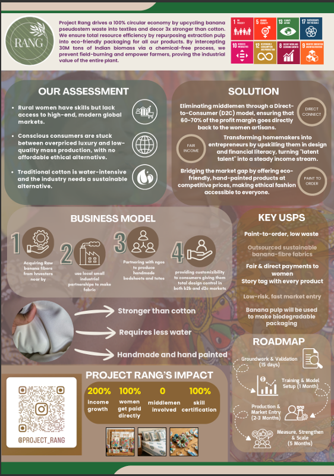
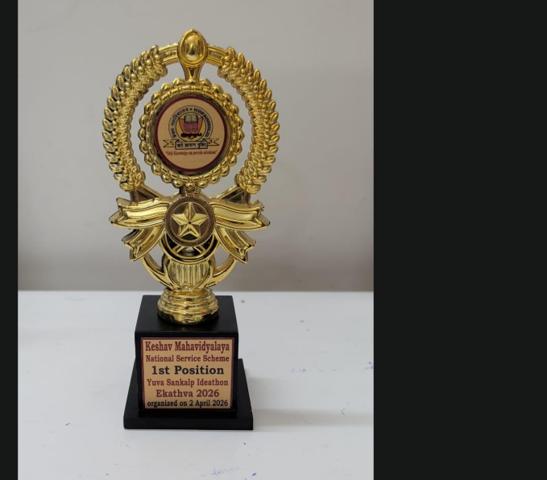

# Rang

<h3 align="left">Sustainable Lifestyle Startup Concept Built Around Banana Fibre Innovation</h3>

  <a href="https://project--rang.vercel.app/">Live Website</a>

---

## About The Project

Rang is a sustainable lifestyle startup concept focused on transforming agricultural waste, particularly banana fibre and banana pulp, into eco-friendly consumer products.

The project combines market research, product development, branding, packaging design, digital marketing, and business strategy to create environmentally responsible products while promoting circular economy principles.

Our objective was to explore how agricultural waste can be converted into meaningful products that are functional, aesthetically appealing, and commercially viable.

---

## Website

The website serves as Rang's digital storefront, showcasing the brand story, sustainability mission, product portfolio, and consumer value proposition.

  

### Live Demo

https://project--rang.vercel.app/

---

## Market Research & Consumer Validation

Extensive consumer research was conducted to understand sustainability awareness, purchasing behavior, pricing expectations, customization preferences, and product expectations.

### Key Findings

- 80% of respondents expressed willingness to purchase sustainable banana-based products.
- 70% preferred banana-fibre products over conventional alternatives.
- 90% considered durability an important purchasing factor.
- 65% were willing to pay a premium for sustainable products.
- 100% indicated customization would increase purchase intent.
- 85% responded positively to products manufactured from agricultural waste.

### Research Deliverables

- Consumer Insights Report
- Survey Questionnaire
- Survey Responses
- Market Validation Analysis
- Research Documentation
- Startup Pitch Deck

Available in:

`market_research/`

---
## Logo

  

## Product Development

Multiple sustainable product concepts were designed and prototyped using banana-fibre materials.

  

### Product Categories

- Tote Bags
- Lifestyle Accessories
- Sustainable Utility Products
- Home Décor Concepts
- Customizable Product Variants

The product development process focused on combining sustainability, durability, aesthetics, and functionality while utilizing agricultural waste as a raw material.

---

## Packaging Design

Packaging concepts were developed using insights gathered through consumer research.

  

The packaging strategy focused on:

- Sustainability
- Minimal Packaging Waste
- Brand Consistency
- Customer Experience
- Cost Efficiency

The goal was to create packaging that reflected Rang's sustainability mission while maintaining a premium brand identity.

---

## Branding & Identity

A complete visual identity was developed for Rang, focusing on sustainability, craftsmanship, authenticity, and modern aesthetics.

### Assets Developed

- Brand Logo
- Product Tags
- Posters
- Instagram Campaign Creatives
- Storytelling Assets
- Visual Identity Concepts

  

The branding strategy was designed to communicate sustainability, innovation, and responsible consumption through a consistent visual language.

---

## Marketing & Digital Presence

Marketing efforts focused on building awareness around sustainable products and communicating the brand's mission.

Developed assets include:

- Social Media Creatives
- Product Photography
- Brand Storytelling Content
- Promotional Campaign Assets
- Consumer Awareness Material

Branding and marketing resources are available throughout the repository.

---

## Business Strategy

The business model focused on:

- Sustainable Product Innovation
- Agricultural Waste Utilization
- Circular Economy Principles
- Consumer-Driven Product Design
- Sustainable Packaging
- Market Validation

The project also explored collaboration opportunities with:

- Banana Fibre Suppliers
- Sustainable Material Manufacturers
- Artisan Communities
- Eco-Conscious Consumer Segments
- Entrepreneurship Platforms

These partnerships were investigated to build a scalable ecosystem supporting both sustainability and economic value creation.

---

## Recognition

  

The project has been presented across multiple startup, innovation, and business-plan competitions, receiving recognition for its sustainability-focused business model and product development approach.

---

## Project Deliverables

- Website & Digital Storefront
- Consumer Research & Market Validation
- Product Prototypes
- Packaging Concepts
- Brand Identity Assets
- Marketing Campaign Creatives
- Business Strategy Documentation
- Startup Pitch Deck
- Competition Submissions
- Certificates & Recognition

---

## Repository Highlights

📁 Website Source Code

📁 Product Prototypes

📁 Packaging Concepts

📁 Branding Assets

📁 Marketing Creatives

📁 Market Research & Consumer Insights

📁 Startup Pitch Deck

📁 Competition Documentation

📁 Certificates & Recognition

---

## Vision

To transform agricultural waste into meaningful products that combine sustainability, functionality, and design while promoting responsible consumption and circular economy principles.